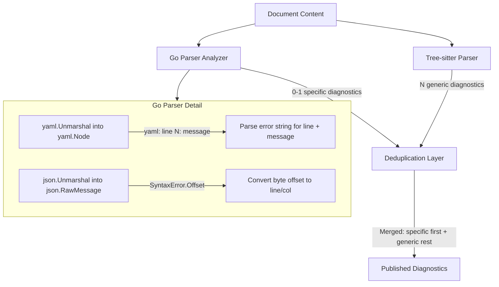

# Go Parser Diagnostic Integration

## Motivation

Tree-sitter provides excellent error recovery (multiple errors per file) but generic messages ("Syntax error near '...'"). Go's native `yaml.v3` and `encoding/json` parsers produce highly specific messages like:

- YAML: "found a tab character where an indentation space is expected", "did not find expected key", "mapping values are not allowed in this context"
- JSON: "invalid character ',' after object key:value pair", "unexpected end of JSON input"

By running both and deduplicating, we get specific messages for the first error and continued coverage for all subsequent errors.

## Architecture




## Key Design Decisions

- **Go parsers stop at the first error** -- this is fine because tree-sitter covers subsequent errors. We're augmenting, not replacing.
- **Deduplication by line overlap**: If a Go parser diagnostic is on the same line as a tree-sitter `syntax-error` or `missing-token`, suppress the tree-sitter one and keep the Go parser one (better message).
- **Both `yaml.v3` and `encoding/json` are already dependencies** in `go.mod` -- no new deps needed.
- **Diagnostic codes**: `yaml-parse-error` and `json-parse-error`, distinct from the tree-sitter `syntax-error` and `missing-token` codes.

## Files to Create / Modify

### 1. New: `[server/rules/checks/parse_errors.go](server/rules/checks/parse_errors.go)`

Two new analyzers:

- `**registerYAMLParseErrors`**: Runs `yaml.Unmarshal(content, &yaml.Node{})`. Parses the error string with regex `^yaml: line (\d+): (.+)$` to extract line number and message. Falls back to `^yaml: (.+)$` for errors without line info.
- `**registerJSONParseErrors`**: Runs `json.Unmarshal(content, &json.RawMessage{})`. On `*json.SyntaxError`, uses `Offset` field to compute line/col via a helper that scans for newlines.

Helper functions:

- `parseYAMLErrorMsg(err error) (line int, msg string, ok bool)` -- extracts structured info from yaml error string
- `offsetToPosition(content []byte, offset int64) protocol.Position` -- converts byte offset to LSP position

Both analyzers:

- Get content from `ctx.Tree.Source()` (works in both LSP and CLI)
- Get URI from `ctx.UserData.(*rules.AnalysisData).DocURI` to determine YAML vs JSON
- Produce diagnostics with `Severity: Error`, `Source: "telescope"`, `Code: "yaml-parse-error"` / `"json-parse-error"`
- Set range to the full line where the error occurs (highlights the problematic line)

### 2. Modify: `[server/rules/checks/register.go](server/rules/checks/register.go)`

Add entries for `registerYAMLParseErrors` and `registerJSONParseErrors` with corresponding `RuleMeta` values in the `RegisterAll` function.

### 3. New: `[server/rules/dedup.go](server/rules/dedup.go)`

```go
func DeduplicateParserDiagnostics(diags []protocol.Diagnostic) []protocol.Diagnostic
```

Logic:

- Collect the line numbers of all `yaml-parse-error` / `json-parse-error` diagnostics
- Filter out any `syntax-error` or `missing-token` diagnostics whose range overlaps those lines
- Return the deduplicated slice

This is a pure function usable by both the LSP transformer and the CLI pipeline.

### 4. Modify: `[server/lsp/ruleset_manager.go](server/lsp/ruleset_manager.go)`

In `buildTransformer()`, wrap the existing transformer to call `rules.DeduplicateParserDiagnostics` as a post-processing step on the merged diagnostic slice before publishing.

### 5. Modify: `[server/cli/lint.go](server/cli/lint.go)`

In `lintFile()`, after combining diagnostics from `RunAnalyzers`, `RunChecks`, and plugin rules, call `rules.DeduplicateParserDiagnostics` on the combined slice.

### 6. New: `[server/rules/checks/parse_errors_test.go](server/rules/checks/parse_errors_test.go)`

Unit tests covering:

- YAML with tab indentation -> specific "found a tab character..." message
- YAML with missing key -> specific "did not find expected key" message
- YAML with invalid character -> specific message
- JSON with trailing comma -> specific "invalid character..." message
- JSON with unquoted key -> specific message
- JSON with unexpected end -> specific message
- Valid YAML -> no Go parser diagnostics
- Valid JSON -> no Go parser diagnostics

### 7. New: `[server/rules/dedup_test.go](server/rules/dedup_test.go)`

Unit tests for the deduplication function:

- Go parser diagnostic on same line as `syntax-error` -> `syntax-error` suppressed
- Go parser diagnostic on same line as `missing-token` -> `missing-token` suppressed
- Non-overlapping `syntax-error` diagnostics preserved
- No Go parser diagnostics -> all tree-sitter diagnostics preserved
- Mixed diagnostic codes (other codes not affected)

## Example Output Comparison

**Before (tree-sitter only):**

```
line 3: Error [syntax-error] Syntax error near '	bad_indent: true'
line 7: Error [syntax-error] Syntax error near 'missing_colon value'
```

**After (Go parser + tree-sitter):**

```
line 3: Error [yaml-parse-error] Found a tab character where an indentation space is expected
line 7: Error [syntax-error] Syntax error near 'missing_colon value'
```

The first error gets a specific, actionable message from `yaml.v3`. Subsequent errors that `yaml.v3` never reaches still get reported by tree-sitter.